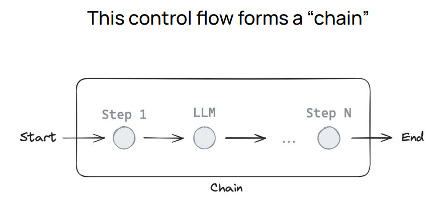

1. In LangGraph, `"Chain"` refers to a sequence of tasks that are executed in a specific order to process input data and generate the desired output.
2. This helps to build modular workflows where each component of the chain contributes to the final result.



#### Messages

  1. Chat models can use messages, which capture different roles within a conversation.
  2. LangChain supports various message types, including HumanMessage, AIMessage, SystemMessage, and ToolMessage.
  3. These represent a message from the user, from chat model, for the chat model to instruct behavior, and from a tool call.

   ```python
    from pprint import pprint
    from langchain_core.messages import AIMessage, HumanMessage

    messages = [AIMessage(content=f"So you said you were researching ocean mammals?", name="Model")]
    messages.append(HumanMessage(content=f"Yes, that's right.",name="Lance"))
    messages.append(AIMessage(content=f"Great, what would you like to learn about.", name="Model"))
    messages.append(HumanMessage(content=f"I want to learn about the best place to see Orcas in the US.", name="Lance"))

    for m in messages:
        m.pretty_print()
    ```

#### Tools
  1. Tools are used to enhance workflows by enabling specific actions such as fetching data from a database, calling an external API, or performing calculations.
  2. Tools in LangGraph are modular, meaning they can be easily integrated into chains to perform specific tasks and it also can be reused across different chains


  3. The multiply function is our tool and we bind the tool with the llm.

   ```python
    def multiply(a: int, b: int) -> int:
        """Multiply a and b.

        Args:
            a: first int
            b: second int
        """
        return a * b

    llm_with_tools = llm.bind_tools([multiply])
    ```

  4. Now we try to invoke the tool binded llm with the user query.

    ```python
    tool_call = llm_with_tools.invoke([HumanMessage(content=f"What is 2 multiplied by 3", name="Lance")])
    tool_call.additional_kwargs['tool_calls']
    ```

  5. This invocation provide us with result that contains information about "which function(tool) be called","what are the arguments".
  ```js
   `[{'id': 'call_OP4qwtGk4gTIaIySPFHkpbB2',
  'function': {'arguments': '{"a":2,"b":3}', 'name': 'multiply'},
  'type': 'function'}]`
  ```
#### Experiment
  1. What if I intentionally change the code inside the "multiply" function from `"a*b"` to `"a+b"`.
  2. And give the query as "add two numbers 4 and 5", will LLM still pick the "multiply" tool still now?.

   ```python
    def multiply(a: int, b: int) -> int:
    """Multiply a and b.

    Args:
        a: first int
        b: second int
    """
    return a + b
    ```

  3. No, LLM will not pick the "multiply" tool, here are some reasons why?
    <table class="table-size-for-cloud-services">
  <tr>
    <th>Deciding Factors</th>
    <th>Reason</th>
  </tr>
  <tr>
    <td class="custom-header">Tool Metadata</td>
    <td>
      Behind the LangGraph, it sends the metadata (function name, description) of the function in the prompt, not all the code. So, it is necessary to give the relevant function name and description.
    </td>
  </tr>
  <tr>
    <td class="custom-header">Natural Language Understanding</td>
    <td>
      The LLM processes the user’s query, "add two numbers 2 and 3", and identifies that the operation requested is addition. Since your multiply tool performs multiplication (even though it's incorrectly coded to add in this example), the LLM understands this tool is for multiplication and will not call it for addition tasks unless it is explicitly labeled as such.
    </td>
  </tr>
  <tr>
    <td class="custom-header">Intent Matching</td>
    <td>
      The LLM uses intent matching to decide which tool to invoke. It maps the user's request ("add two numbers") to the closest registered tool that performs addition. Since your tool is named or registered as a multiply tool, the LLM is unlikely to invoke it because it doesn't match the user's request.
    </td>
  </tr>
</table>
