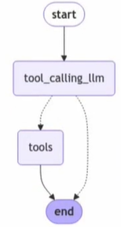

Router is where the chat model routes between a direct response or a tool call based on the user query.



1. The doted lines from the "tool_calling_llm" is Conditional edge. this will look at the chat model model output, and route to our tool calling node or simply end if no tool call is performed.

 ```python
    from langchain_openai import ChatOpenAI

    def multiply(a: int, b: int) -> int:
        """Multiply a and b.

        Args:
            a: first int
            b: second int
        """
        return a * b

    llm = ChatOpenAI(model="gpt-4o")
    llm_with_tools = llm.bind_tools([multiply])
    ```

2. Build the StateGraph for the above diagram.

 ```python
    from langgraph.graph import StateGraph, START, END
    from langgraph.graph import MessagesState
    from langgraph.prebuilt import ToolNode
    from langgraph.prebuilt import tools_condition

    # Node
    def tool_calling_llm(state: MessagesState):
        return {"messages": [llm_with_tools.invoke(state["messages"])]}

    # Build graph
    builder = StateGraph(MessagesState)
    builder.add_node("tool_calling_llm", tool_calling_llm)
    builder.add_node("tools", ToolNode([multiply]))
    builder.add_edge(START, "tool_calling_llm")
    builder.add_conditional_edges(
        "tool_calling_llm",
        # If the latest message (result) from assistant is a tool call -> tools_condition routes to tools
        # If the latest message (result) from assistant is a not a tool call -> tools_condition routes to END
        tools_condition,
    )
    builder.add_edge("tools", END)
    graph = builder.compile()
    ```
