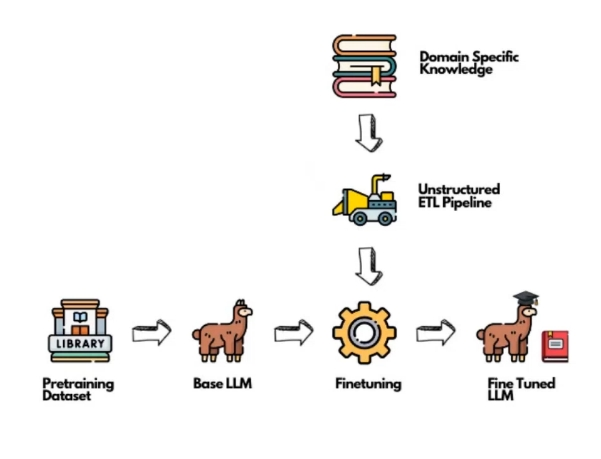

# Steps in Finetuning

1. Step 1: Pre-training dataset
      1. The pre-training dataset forms the backbone of the model’s initial learning. This dataset is large, diverse, and designed to help the model grasp language patterns, grammar, and general knowledge. Typically, it includes a vast amount of text from books, websites, and articles. The aim at this stage is to expose the model to as much data as possible

2. Step 2: Base LLM
      1. The base LLM (Large Language Model) is the result of the initial pre-training. This is a general-purpose model that has learned to predict words, generate coherent text, and understand broad topics. At this stage, the model is versatile but lacks expertise in any specific domain.

3. Step 3: Domain Specific Knowledge
      1. The next step involves introducing domain-specific knowledge. This knowledge is tailored to the particular area in which the model needs to perform. Whether it's legal, medical, or technical fields, this step ensures the model becomes familiar with the unique vocabulary, terminology, and context of the targeted domain. This specialized data is essential for preparing the model to handle more complex or niche tasks effectively.

4. Step 4: ETL Pipeline
      1. In this step, the domain-specific data is collected, cleaned, and processed before it is used for fine-tuning. The extraction phase involves gathering relevant information, transforming it ensures that the data is in the correct format, and loading means it is fed into the model. A well-structured ETL pipeline ensures that the data used in fine-tuning is high-quality, consistent, and ready for training.

5. Step 5: Fine Tuning
      1. During fine-tuning, the base model is trained on the domain-specific data. This process involves adjusting the model’s parameters so it becomes better suited for tasks in the particular domain. Fine-tuning is a careful process that requires monitoring the model’s performance to ensure that it is learning from the new data without forgetting the general knowledge it gained during pre-training. This step transforms the general-purpose model into one that can perform specialized tasks more effectively.

6. Step 6: Fine Tuned LLM
      1. This model retains the broad knowledge it gained during pre-training but is now enhanced with domain-specific expertise. The fine-tuned model can deliver more accurate, context-aware results and is better suited for real-world applications within the target domain.
